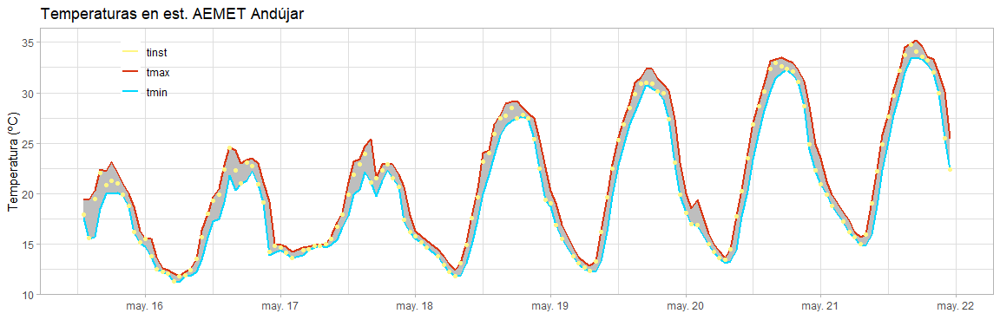

Primer Informe
================
Francisco Salas
17/05/2020

### Descripción

Este es el primer informe del análisis de datos de observación de las
estaciones de AEMET.

### Presentación de gráficos

En el siguiente gráfico se pueden observar las temperaturas máximas,
mínimas, y las muestras instantáneas disponibles, para la estación
meteorológica de AEMET en Andújar (Jaén), los días 15 a 17 de mayo.

<!-- -->

### Código fuente

El código utilizado para el análisis se adjunta a continuación.

``` r
# library imports
library(tidyverse)

# import aemet data
data = read.csv("aemet_data.csv", row.names = 1)
data = data %>% mutate(fechahora=as.POSIXct(fechahora, format="%Y-%m-%d %H:%M:%S"))

# plot data
data %>% ggplot(aes(x = fechahora, y = tinst)) + 
  geom_line(aes(y = tmax, color = "tmax"), size = 2) + 
  geom_line(aes(y = tmin, color = "tmin"), size = 2) + 
  geom_ribbon(aes(ymin=tmin,ymax=tmax), fill="grey") + 
  geom_point() + 
  theme_light() + 
  theme(legend.position = c(0.90,0.11), legend.title = element_blank(), legend.background = element_blank()) +  
  xlab("") + ylab ("Temperatura (ºC)") + ggtitle("Temperaturas en est. AEMET Andújar")
```
